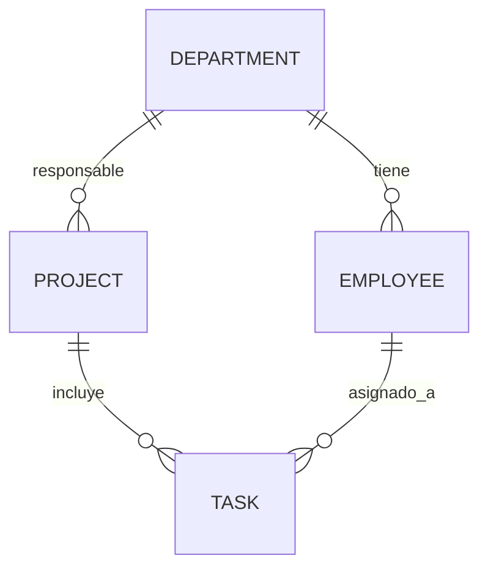

# Documentación - API de Gestión de Agencia

## Contexto resuelto

Se implementó una API REST para gestionar departamentos, empleados, proyectos y tareas, con cálculo automático del avance de cada proyecto.

## Stack

- NestJS
- TypeORM
- MySQL
- DTOs con class-validator
- Variables de entorno con @nestjs/config

## Modelo relacional (MER)



### Entidades

1. Department
   - id (PK)
   - name (único)

2. Employee
   - id (PK)
   - firstName
   - lastName
   - email (único)
   - department (FK -> Department)

3. Project
   - id (PK)
   - name
   - startDate
   - department (FK -> Department)

4. Task
   - id (PK)
   - title
   - description
   - status (PENDIENTE | EN_PROGRESO | COMPLETADA)
   - project (FK -> Project)
   - assignee (FK -> Employee, opcional)

## Lógica de negocio

El endpoint `GET /projects/:id/detail` retorna:

- departamento responsable
- lista de tareas
- empleado asignado por tarea
- porcentaje de avance calculado automáticamente

Fórmula:

$$
avance(\%) = \begin{cases}
0, & \text{si } totalTareas = 0 \\
\frac{tareasCompletadas}{totalTareas} \times 100, & \text{en otro caso}
\end{cases}
$$

## Endpoints

### Departamentos
- `POST /departments`
- `GET /departments`
- `GET /departments/:id`
- `PATCH /departments/:id`

### Empleados
- `POST /employees`
- `GET /employees`
- `GET /employees/:id`
- `PATCH /employees/:id`

### Proyectos
- `POST /projects`
- `GET /projects`
- `GET /projects/:id`
- `PATCH /projects/:id`
- `GET /projects/:id/detail`

### Tareas
- `POST /tasks`
- `GET /tasks`
- `GET /tasks/:id`
- `PATCH /tasks/:id`

## Configuración del entorno

1. Copiar `.env.example` a `.env`
2. Ajustar credenciales MySQL
3. Ejecutar:

```bash
npm install
npm run start:dev
```

## Estructura de módulos implementados

- `departments`
- `employees`
- `projects`
- `tasks`
- `common/enums`

## Comentarios en código

Se agregaron comentarios en zonas críticas, especialmente en el cálculo del progreso del proyecto dentro de `ProjectsService`.
